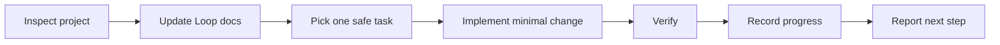

# Loop Engineering Workflow

[](LICENSE)
[](SKILL.md)
[](README.md)
[](https://github.com/Dezoff-max/loop-engineering-workflow)

Loop Engineering Workflow is a Codex skill for running a small, safe, verified development loop inside an existing project.

It helps Codex inspect a repository, maintain lightweight project planning files, choose one practical next task, implement the smallest useful change, verify it, and record progress.

## What It Does

- Analyzes the current project structure before editing.
- Creates or updates `AGENTS.md`, `project-analysis.md`, `roadmap.md`, `progress.md`, `loop.md`, and `verification.md`.
- Selects exactly one small, safe task from the roadmap.
- Runs the best available verification for the project.
- Records what changed, which checks ran, and what should happen next.
- Uses English by default, unless the user asks for another language.

## Workflow



## Repository Structure

```text
.
+-- SKILL.md
+-- agents/
|   +-- openai.yaml
+-- CHANGELOG.md
+-- install.sh
+-- LICENSE
+-- README.md
```

## Installation

Install with the included script:

```bash
curl -fsSL https://raw.githubusercontent.com/Dezoff-max/loop-engineering-workflow/main/install.sh | bash
```

Or clone this repository manually into your Codex skills directory:

```bash
mkdir -p ~/.codex/skills
git clone https://github.com/Dezoff-max/loop-engineering-workflow.git ~/.codex/skills/loop
```

You can install into a custom location with:

```bash
curl -fsSL https://raw.githubusercontent.com/Dezoff-max/loop-engineering-workflow/main/install.sh | INSTALL_DIR="$HOME/.codex/skills/loop-dev" bash
```

If `~/.codex/skills/loop` already exists and is not this repository, the installer stops without changing it.

## Usage

Inside Codex, invoke the skill with:

```text
$loop
```

You can also ask for it naturally:

```text
Loop: continue this project from the roadmap.
```

More examples:

```text
$loop analyze this repository and run the first safe task.
```

```text
Use Loop Engineering to continue from roadmap.md and progress.md.
```

```text
Loop: set up the project planning files, verify the app, and report the next task.
```

## Generated Project Files

The skill maintains these files in the target project:

| File | Purpose |
| --- | --- |
| `AGENTS.md` | Project-specific rules for Codex. |
| `project-analysis.md` | Current structure, stack, commands, risks, and recommended work. |
| `roadmap.md` | Small, checkable tasks with clear success criteria. |
| `progress.md` | Append-only history of completed loop work. |
| `loop.md` | The operating procedure for future loop runs. |
| `verification.md` | Commands and manual checks that define done. |

## Safety Principles

- Prefer small, reviewable changes over broad rewrites.
- Preserve the project's existing stack, structure, and visual style.
- Do not delete important files or run destructive commands without explicit approval.
- Do not publish, deploy, or expose anything publicly without explicit approval.
- Do not mark a task complete unless verification passed or the task was documentation-only and manually reviewed.

## Compatibility

This skill is designed for the Codex skill layout:

```text
~/.codex/skills/loop/SKILL.md
~/.codex/skills/loop/agents/openai.yaml
```

It is project-agnostic and can be used with web apps, macOS apps, static prototypes, documentation projects, and other repositories where incremental verified work is useful.

## License

MIT License. See [LICENSE](LICENSE).
