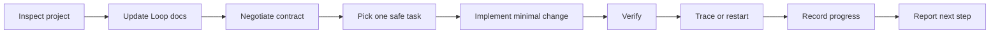

# Loop Engineering Workflow

[](LICENSE)
[](SKILL.md)
[](README.md)
[](https://github.com/Dezoff-max/loop-engineering-workflow)

Loop Engineering Workflow is a Codex skill for running a small, safe, verified development loop inside an existing project.

It helps Codex inspect a repository, maintain lightweight project planning files, negotiate a task contract, choose one practical next task, implement the smallest useful change, verify it, trace failures, and record progress.

## What It Does

- Analyzes the current project structure before editing.
- Creates or updates `AGENTS.md`, `project-analysis.md`, `contract.md`, `roadmap.md`, `progress.md`, `trace.md`, `loop.md`, and `verification.md` using stable templates.
- Supports `setup`, `continue`, `audit-only`, `repair`, `matrix`, and `doctor` modes.
- Separates planner, builder, and evaluator responsibilities through an explicit task contract.
- Selects exactly one small, safe task from the roadmap using impact, risk, effort, and confidence scoring.
- Runs the best available verification for the project using a stack-aware verification matrix.
- Records what changed, which checks ran, what should happen next, the current bottleneck, trace evidence, and a handoff note for the next loop.
- Uses English by default, unless the user asks for another language.

## Workflow



## Repository Structure

```text
.
+-- AGENTS.md
+-- SKILL.md
+-- agents/
|   +-- openai.yaml
+-- CHANGELOG.md
+-- examples/
|   +-- contract.md
|   +-- doctor-report.md
|   +-- prompts.md
|   +-- trace.md
|   +-- verification-matrix.md
+-- install.sh
+-- LICENSE
+-- README.md
+-- scripts/
|   +-- check.sh
+-- templates/
|   +-- AGENTS.md
|   +-- contract.md
|   +-- loop.md
|   +-- progress.md
|   +-- project-analysis.md
|   +-- roadmap.md
|   +-- trace.md
|   +-- verification.md
+-- verification.md
```

## Installation

Install with the included script:

```bash
curl -fsSL https://raw.githubusercontent.com/Dezoff-max/loop-engineering-workflow/main/install.sh | bash
```

Or clone this repository manually into your Codex skills directory:

```bash
mkdir -p ~/.codex/skills
git clone https://github.com/Dezoff-max/loop-engineering-workflow.git ~/.codex/skills/loop-engineering-workflow
```

You can install into a custom location with:

```bash
curl -fsSL https://raw.githubusercontent.com/Dezoff-max/loop-engineering-workflow/main/install.sh | INSTALL_DIR="$HOME/.codex/skills/loop-dev" bash
```

If the target install directory already exists and is not this repository, the installer stops without changing it.

If the legacy path `~/.codex/skills/loop` exists and the default path does not, the installer stops to avoid duplicate skills with the same `name: loop`. If both paths already exist, the installer warns so you can keep only one active copy.

## Usage

Inside Codex, invoke the skill with:

```text
$loop
```

You can also ask for it naturally:

```text
Loop: continue this project from the roadmap.
```

More examples:

```text
$loop analyze this repository and run the first safe task.
```

```text
Use Loop Engineering to continue from roadmap.md and progress.md.
```

```text
Loop: set up the project planning files, verify the app, and report the next task.
```

```text
Loop setup: create the planning files and run the first safe task.
```

```text
Loop continue: pick the next roadmap item, implement it, verify it, and update progress.
```

```text
Loop audit-only: inspect the project and report what should happen next without editing files.
```

```text
Loop repair: clean up stale Loop docs and verification instructions without changing app code.
```

```text
Loop matrix: build or refresh the project's verification matrix without changing app code.
```

```text
Loop doctor: check whether the Loop files are healthy and ready to continue.
```

## Operating Modes

| Mode | Purpose |
| --- | --- |
| `setup` | Inspect a project, create or update Loop files from templates, and run one first safe task unless told otherwise. |
| `continue` | Read existing Loop files, choose one next roadmap task, implement it, verify it, and record progress. |
| `audit-only` | Inspect the project and Loop files, then report findings without editing files. |
| `repair` | Fix missing, stale, or inconsistent Loop documentation without changing application code unless explicitly requested. |
| `matrix` | Build or refresh `verification.md` with stack-specific commands, manual checks, success signals, and fallbacks without changing application code. |
| `doctor` | Run a read-only health check for Loop files, stale commands, weak task definitions, missing scoring, and done tasks without evidence. |

## Generated Project Files

The skill maintains these files in the target project:

| File | Purpose |
| --- | --- |
| `AGENTS.md` | Project-specific rules for Codex. |
| `project-analysis.md` | Current structure, stack, commands, risks, and recommended work. |
| `contract.md` | The current task contract: scope, done criteria, checks, and restart signals. |
| `roadmap.md` | Small, checkable tasks with clear success criteria. |
| `progress.md` | Append-only history of completed loop work, bottlenecks, and handoff notes. |
| `trace.md` | Append-only trace of failures, restarts, and judgment divergences. |
| `loop.md` | The operating procedure for future loop runs. |
| `verification.md` | Commands and manual checks that define done. |

## Contract

`contract.md` separates the roles in the loop:

- Planner defines why the task matters and what done means.
- Builder works only inside the allowed scope.
- Evaluator checks the result against the contract and verification matrix.

Implementation should not start until the contract is concrete enough to evaluate.

## Task Scoring

Roadmap tasks include:

- `Impact`
- `Risk`
- `Effort`
- `Confidence`
- `Score`

Loop uses these fields to choose the highest-value safe task that can fit in one verified loop.

## Handoff

`progress.md` includes a handoff section with the current state, next recommended task, known blockers, commands that passed or failed, and current bottleneck. This helps the next Loop run continue without rediscovering the same context.

## Trace And Restart

`trace.md` records failures, restarts, and judgment divergences. If verification repeats the same failure, the contract is wrong, or the task grows beyond one safe loop, Loop should stop patching, write a trace entry, shrink the contract, and restart from the smaller task.

## Bottlenecks

Each progress entry should name the current bottleneck: planning, contract, implementation, verification, documentation, architecture, UX, release, or harness.

## Templates

The `templates/` directory provides stable starting structures for generated Loop files. Codex should use these templates as a baseline, then adapt them to the current project instead of copying generic placeholders blindly.

## Verification Matrix

Loop chooses the narrowest check that proves the selected task. In `matrix` mode, the verification matrix itself is the deliverable. The skill includes verification guidance for:

- Node, Next.js, Vite, React, and TypeScript projects.
- Python projects.
- Swift, iOS, and macOS projects.
- Static HTML, CSS, and vanilla JavaScript projects.
- Documentation-only and knowledge projects.

## Doctor Mode

`doctor` mode is read-only. It reports Loop health as `pass`, `warn`, or `fail`, then recommends the next mode: `repair`, `matrix`, `continue`, or `setup`.

It checks required files, placeholder content, contract quality, roadmap scoring, progress evidence, trace quality, stale verification commands, stale harness, and unsafe instructions.

## Report Formats

`doctor` reports use a health table with `Check`, `Result`, `Evidence`, and `Recommendation`.

`matrix` reports use a verification table with `Area`, `Command or check`, `When to run`, `Success signal`, and `Fallback`.

Examples live in `examples/`.

## Self-test

Run the skill self-test with:

```bash
scripts/check.sh
```

It validates the skill frontmatter, required templates, documented modes, shell syntax, roadmap scoring fields, handoff block, bottleneck fields, contract/trace templates, verification matrix, and trailing whitespace.

## Maintainer Notes

Repository-specific maintenance rules live in `AGENTS.md`. Verification expectations for this skill repository live in `verification.md`.

## Safety Principles

- Prefer small, reviewable changes over broad rewrites.
- Preserve the project's existing stack, structure, and visual style.
- Do not delete important files or run destructive commands without explicit approval.
- Do not publish, deploy, or expose anything publicly without explicit approval.
- Do not mark a task complete unless verification passed or the task was documentation-only and manually reviewed.

## Contributing

Forks, issues, and pull requests are welcome. If you adapt Loop Engineering Workflow for your own Codex setup, feel free to share improvements that keep the skill small, safe, and easy to verify.

## Compatibility

This skill is designed for the Codex skill layout:

```text
~/.codex/skills/loop-engineering-workflow/SKILL.md
~/.codex/skills/loop-engineering-workflow/agents/openai.yaml
~/.codex/skills/loop-engineering-workflow/templates/*.md
```

It is project-agnostic and can be used with web apps, macOS apps, static prototypes, documentation projects, and other repositories where incremental verified work is useful.

## License

MIT License. See [LICENSE](LICENSE).
